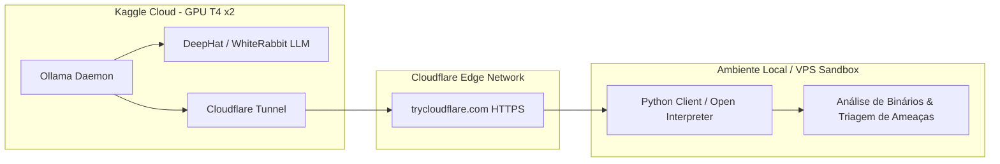

# 🤖 Kaggle Cyber Agent — Sandbox AI Framework

<div align="center">

[](https://python.org)
[](https://kaggle.com)
[](https://ollama.ai)
[](https://cloudflare.com)
[](https://github.com/zGordola1)

</div>

---

## 📌 Visão Geral

O **Kaggle Cyber Agent** é um framework completo para orquestração de **Agentes de Inteligência Artificial voltados para Cibersegurança e Análise de Ameaças em Ambientes Isolados (Sandbox)**.

Ele permite aproveitar o poder computacional de GPUs de alta performance (Kaggle GPU T4 x2) de forma 100% gratuita, executando LLMs especializadas em segurança ofensiva/defensiva (**DeepHat / WhiteRabbitNeo**) via **Ollama**, e expondo o endpoint com criptografia ponta a ponta através de **Cloudflare Tunnels** para que clientes locais ou VPS executem rotinas em sandbox de forma segura e autônoma.

---

## 🏛️ Arquitetura do Sistema



---

## ⚙️ Principais Características

- 🚀 **Zero Custo de Hardware:** Utilização de instâncias GPU remotas no Kaggle para inferência rápida sem sobrecarregar a máquina local.
- 🛡️ **Zero Port Forwarding:** Túnel criptografado temporário com a Cloudflare (`trycloudflare.com`), sem necessidade de abrir portas no roteador ou expor IPs reais.
- 🧠 **Modelos Especializados:** Suporte nativo ao `DeepHat-V1-7B` e `whiterabbitneo-v1.5a:7b` (modelos com entendimento profundo de código, exploits, engenharia reversa e análise de malware).
- 🔒 **Execução Segura em Sandbox:** Interface com o Open Interpreter / Client Python para análise de binários, scripts suspeitos e RATs dentro de ambientes isolados.

---

## 🚀 Como Executar

### 1. No Kaggle (Servidor de IA)
1. Crie um novo Notebook no [Kaggle](https://www.kaggle.com/) com a opção **GPU T4 x2** e **Internet: On**.
2. Cole o conteúdo de [`kaggle_server.py`](./kaggle_server.py) na primeira célula e execute.
3. Copie a URL pública gerada no final (ex: `https://xxxx.trycloudflare.com/v1`).

### 2. No seu Cliente Local / VPS (Sandbox)
1. Instale as dependências:
   ```bash
   pip install -r requirements.txt
   ```
2. Execute o instalador automático passando a URL do Cloudflare:
   ```bash
   python setup_agent.py --cloudflare-url https://sua-url.trycloudflare.com
   ```
3. Valide o funcionamento:
   ```bash
   python test_agent.py
   ```

---

## 📁 Estrutura de Arquivos

```text
├── kaggle_server.py     # Script para download do Ollama, modelo e subida do Cloudflare Tunnel
├── setup_agent.py       # Configurador do cliente e variáveis de ambiente
├── test_agent.py        # Script de teste de conectividade e inferência com a IA
├── install.sh           # Script de instalação para ambientes Linux/VPS
├── GUIA_DE_USO.md       # Guia passo a passo ilustrado
└── requirements.txt     # Dependências Python
```

---

## ⚠️ Disclaimer de Ética e Segurança

Este projeto foi desenvolvido exclusivamente para fins de **pesquisa acadêmica, testes de segurança autorizados, análise de malwares em ambientes controlados (Sandboxes) e engenharia de software defensiva/ofensiva**. O autor não se responsabiliza pelo uso indevido das ferramentas disponibilizadas.
